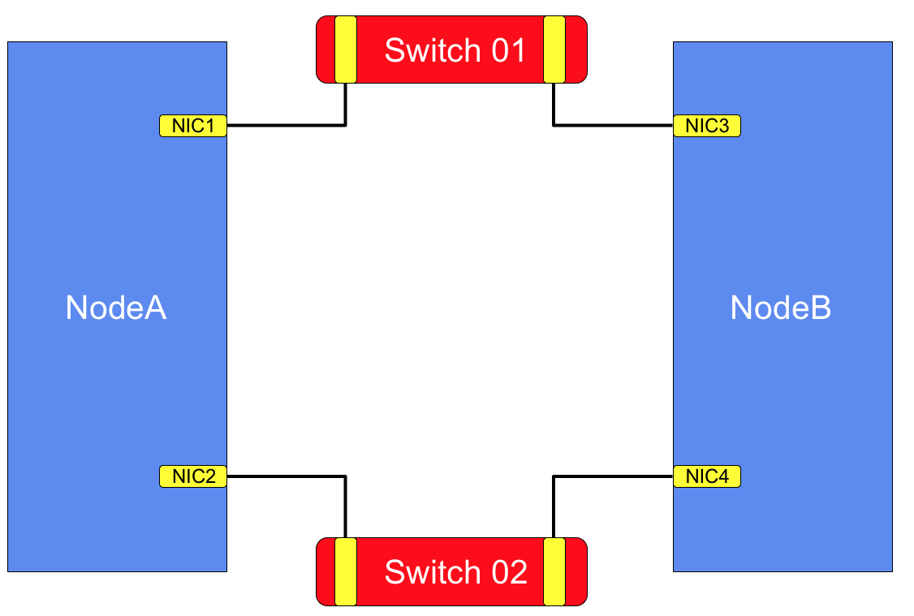
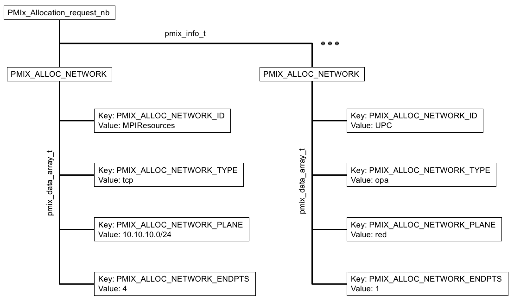

# RFC0030
Extends [RFC0012: Add APIs and internal support for RM-network library interactions](https://github.com/pmix/RFCs/blob/master/RFC0012.md) by adding attributes to support:
  * multi-plane descriptions and allocation requests
  * requesting allocation of resources from specific network type
  * providing the attribute key for referencing the allocation
  * specifying the number of endpoints to be allocated


## Title
Network Resource Allocations

## Abstract
This RFC extends network integration to add attributes allowing description of a broader range of network configurations and allocation requests.


## Labels
[ATTRIBUTES]


## Action
[PROVISIONALLY ACCEPTED]

## Copyright Notice
Copyright (c) 2018 Intel, Inc. All rights reserved.

This document is subject to all provisions relating to code contributions to the PMIx community as defined in the community's [LICENSE](https://github.com/pmix/RFCs/tree/master/LICENSE) file. Code Components extracted from this document must include the License text as described in that file.

## Description
The PMIx standard already includes support by which the resource manager can request fabric configuration information for a given allocation and forward that to the allocated nodes for local configuration of their NICs. This can include environmental variables to be set prior to spawning an application process for directing the network library.



This RFC extends this integration to support a broader range of network configurations and allocation requests. In particular, the RFC addresses the needs of systems that incorporate multiple network "planes", as illustrated at right.

In the diagram, there are two distinct network "planes", each composed of one or more switches connecting nodes across a set of interfaces that are separated from those connecting to switches on the other plane. Thus, traffic on the two planes is isolated from each other. Note that the network interface cards (NICs) on different nodes may have different names than their corresponding peers (e.g., eth0 on one and ens1f on another) due to race conditions at boot and other factors. In addition, the planes may be of different types (e.g., Ethernet vs InfiniBand), and each NIC may support multiple ports and protocols (e.g., TCP vs UDP).

Beyond the need to describe different networks, the continued emergence of hybrid programming models has resulted in a growing need to allow for multiple libraries, each requiring access to its own network resources, to be executing in parallel within a given process. Thus, a mechanism must be defined that allows a caller to delineate that the requested resources target a specific library or consumer.

The preliminary attributes for describing a network resource allocation provided in prior RFCs weren't adequate for handling this degree of complexity. Accordingly, the attributes have been extended by both updating the definition of those in the current standard, and adding new attributes for describing the desired allocation, as shown below:

```c
#define PMIX_ALLOC_NETWORK                  "pmix.alloc.net"        // (pmix_data_array_t*) Array of pmix_info_t describing
                                                                    //         network resource request. This must include at least:
                                                                    //           * PMIX_ALLOC_NETWORK_ID
                                                                    //           * PMIX_ALLOC_NETWORK_TYPE
                                                                    //           * PMIX_ALLOC_NETWORK_ENDPTS
                                                                    //         plus whatever other descriptors are desired
#define PMIX_ALLOC_NETWORK_ID               "pmix.alloc.netid"      // (char*) key to be used when accessing this requested network allocation. The
                                                                    //         allocation will be returned/stored as a pmix_data_array_t of
                                                                    //         pmix_info_t indexed by this key and containing at least one
                                                                    //         entry with the same key and the allocated resource description.
                                                                    //         The type of the included value depends upon the network
                                                                    //         support. For example, a TCP allocation might consist of a
                                                                    //         comma-delimited string of socket ranges such as
                                                                    //         "32000-32100,33005,38123-38146". Additional entries will consist
                                                                    //         of any provided resource request directives, along with their
                                                                    //         assigned values. Examples include:
                                                                    //           * PMIX_ALLOC_NETWORK_TYPE - the type of resources provided
                                                                    //           * PMIX_ALLOC_NETWORK_PLANE - if applicable, what plane the
                                                                    //               resources were assigned from
                                                                    //           * PMIX_ALLOC_NETWORK_QOS - the assigned QoS
                                                                    //           * PMIX_ALLOC_BANDWIDTH - the allocated bandwidth
                                                                    //           * PMIX_ALLOC_NETWORK_SEC_KEY - a security key for the requested
                                                                    //               network allocation
                                                                    //         NOTE: the assigned values may differ from those requested,
                                                                    //         especially if the "required" flag was not set in the request
#define PMIX_ALLOC_NETWORK_TYPE             "pmix.alloc.nettype"    // (char*) type of desired transport (e.g., tcp, udp)
#define PMIX_ALLOC_NETWORK_PLANE            "pmix.alloc.netplane"   // (char*) id string for the NIC (aka plane) to be used for this allocation
                                                                    //         (e.g., CIDR for Ethernet)
#define PMIX_ALLOC_NETWORK_ENDPTS           "pmix.alloc.endpts"     // (size_t) number of endpoints to allocate
#define PMIX_ALLOC_NETWORK_SEC_KEY          "pmix.alloc.nsec"       // (pmix_byte_object_t) network security key
```
In addition to the new/revised definitions, it should be noted that a given allocation request can contain multiple PMIX\_ALLOC\_NETWORK entries, each with their unique PMIX\_ALLOC\_NETWORK\_ID key used to identify the resulting allocation. This is required to allow an application to request resources from multiple planes and/or resources for multiple libraries. Resource managers are free to define their own syntax for users to specify these requests.

An example allocation request is shown below. In this example, two requests for network resources are included, one from the TCP resources and the other for an OPA network. Note that the network "type" is simply a string identifier that is recognized by whomever is managing the network resources - this could be either the PMIx library itself, the host RM, or a combination of the two. The network "plane" designations are similarly arbitrary - in the TCP example, we have chosen to use the subnet, while the OPA example uses a name possibly indicating a classification level. These values will typically match those provided in the hardware inventory for the system, which is usually provided either by installation-provided text files or by an automated management discovery method.



The result of this request will be two entries in the job-level information provided at process start, each retrievable using the provided PMIX\_ALLOC\_NETWORK\_ID value for that request. The retrieved value will be in the form of a pmix\_data\_array\_t composed of pmix\_info\_t structs. The network type and plane (if applicable) information will be included along with the assigned resources in the returned array.

Note that a request that does not stipulate type and/or plane may (depending on implementation) result in assignment of resource from a default network. Also, note that the values returned in the allocation may differ from those requested if the "required" flag was not set in the corresponding pmix\_info\_t struct of the allocaiton request. For example, a request for 100MB/sec of bandwidth that doesn't indicate it is "required" may return a bandwidth of only 10MB/sec based on available resources and scheduling priorities. Users are advised to set the "required" flag on all values considered critical to application execution.


## Protoype Implementation
Prototype code is available in the [topic/pnet](https://github.com/pmix/pmix/pull/700) branch of the PMIx master repository and in the [topic/pnet](https://github.com/pmix/pmix-reference-server/pull/49) branch of the PMIx Reference RTE. An example illustrating use of the new attributes for management of TCP/UDP resources is provided in the src/mca/pnet/tcp component.

## Author(s)
Ralph H. Castain  
Intel, Inc.  
Github: rhc54  
