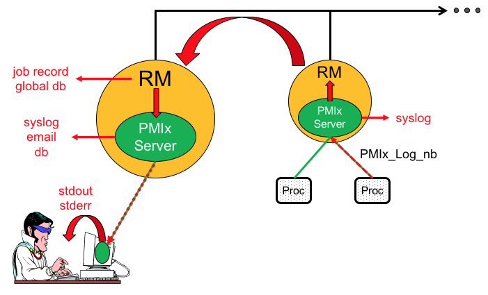

# RFC0032
Extends:  
* [RFC0010: Extension of Tool Interaction Support](https://github.com/pmix/RFCs/blob/master/RFC0010.md)
  * Adds attributes to broaden logging support
  * Defines a "gateway" server type

## Title
Extension of PMIx Logging Support

## Abstract
The PMIx\_Log API supports requests for logging information to a variety of channels. Initial support was only for stdout/stderr - this RFC extends that support to additional channels such as syslog and smtp.

## Labels
[EXTENSION][ATTRIBUTES]

## Action
[APPROVED]

## Copyright Notice
Copyright (c) 2018 Intel, Inc. All rights reserved.

This document is subject to all provisions relating to code contributions to the PMIx community as defined in the community's [LICENSE](https://github.com/pmix/RFCs/tree/master/LICENSE) file. Code Components extracted from this document must include the License text as described in that file.

## Description
RFC0010 added a new PMIx\_Log\_nb API for requesting logging of provided data in some global data store or to standard output locations (e.g., stderr or syslog), subject to available services from the host environment. A limited number of initial keys were provided by which the logging request could direct the data to specific channels on an as-available basis, and the host RM interface was extended through the addition of a "log" interface by which client requests that are not directly supported by the PMIx library can be passed to the host RM for handling - e.g., when the logging data is directed to the stderr or stdout channels.

The illustration below highlights some of the capabilities provided by the extended logging support. Note that the illustration is not intended to be comprehensive in its coverage as the number of possible use-cases is too large to capture in a single drawing.



Supported uses include:

* Writing of messages to syslog, both local (using the PMIX\_LOG\_LOCAL\_SYSLOG attribute) or on the syslog of some central server designated for this purpose. The PMIx client will send the logging request to its local server. If the PMIX\_LOG\_LOCAL\_SYSLOG attribute is included in the request, then the PMIx server will immediately output the message to the local syslog. If not, or if the PMIX\_LOG\_GLOBAL\_SYSLOG attribute is specified, then the PMIx server will "upcall" the request to its host RM daemon. It is the responsibility of the host RM daemon to identify and transfer the provided data to the appropriate location - upon arrival, the RM can use the PMIx\_Log function to deliver the data to the local syslog on that node, or can write the data to syslog itself. Attributes for setting the desired syslog priority are provided - the default is set to LOG\_INFO indicating reporting of an informational message

* Sending notifications via email (or other channels) to a designated user. Application users may wish to be notified of completion of their application, receive periodic progress reports, or be notified of a problem that merits attention. PMIx itself includes support for some of the more popular channels - requests for unsupported channels are referred to the host RM for processing, with an error returned if the requested channel is not available in the host environment

* Outputting tagged log messages to stdout or stderr of the application, or a connected tool. Where supported, an alternative output stream (possibly directed to a dedicated log file) may be specified. Messages may be tagged (via the PMIX\_LOG\_TAG\_OUTPUT} attribute) as flowing via the PMIx\_Log API to differentiate them from the application's normal output. In addition, messages may be timestamped (PMIX\_LOG\_TIMESTAMP\_OUTPUT) or output in XML format (PMIX\_LOG\_XML\_OUTPUT)

* Storing status updates in the job record using the PMIX\_LOG\_JOB\_RECORD attribute. Resource managers nearly always maintain a record of the jobs they schedule and execute. This includes information on the time spent waiting for allocation, priority of the request, identity of the requestor, name/path of the executable and/or job script, etc. Historically, users have had to record status information on their application (e.g., computational progress) in files which are subsequently stored in persistent storage. PMIx\_Log offers the option (where supported) of injecting such status reports directly into the job record, thus providing a single, time sequential record of the job's execution.

  Note that system libraries can also use this feature to record job-affecting events (e.g., network failures) that might have impacted the application during its execution, perhaps linking them to more detailed information stored in a RAS database.

Note that data can be "logged" without specifying the output channel. In this case, the PMIx library will default to logging a copy of the data to each available channel (in the reference implementation, this is done by MCA parameter in addition to the usual build/configuration constraints). The caller can optionally control the logging behavior by providing multiple channel attributes in order of desired priority, subject to the availability of the specified channel. For example, an application could ask that data be emailed to a given user, or logged to a global syslog, or logged to local syslog by specifying first the PMIX\_LOG\_EMAIL attribute, followed by the PMIX\_LOG\_GLOBAL\_SYSLOG and the PMIX\_LOG\_LOCAL\_SYSLOG attributes, with the PMIX\_LOG\_ONCE attribute being included to indicate that only one log channel should be used. If PMIX\_LOG\_ONCE is not indicated, then the data will be logged to all three channels. In this case:

* PMIX\_ERR\_PARTIAL\_COMPLETION is returned if any channel fails to log as requested, but others succeed;
* PMIX\_ERR\_OPERATION\_FAILED is returned if all fail; and
* PMIX\_SUCCESS is returned if all succeed.

This provides flexibility with minimal code complexity when operating in multiple environments that support differing output channels.

Logging attributes can also utilize the "required" flag in the pmix\_info\_t structure to indicate that the data _must_ be logged via the specified channel. If given, failure to complete the operation on that channel will result in return of the PMIX\_ERR\_OPERATION\_FAILED error. Otherwise, use of a given channel is considered "optional" and errors are reported according to the above rules.

Specifying a prioritized list of logging channels on each call to PMIx\_Log can impact the performance of the API itself as it requires the PMIx library to scan available channels to create an ordered list, and this might in turn require multiple passes over the available options. The PMIx reference library provides an MCA parameter to help reduce this impact. A user can control the default order of channel delivery by setting the "plog\_base\_order" MCA parameter to a comma-delimited, prioritized list of channel names based on the corresponding attribute by extracting the characters following "PMIX\_LOG\_", as follows:

* PMIX\_LOG\_LOCAL\_SYSLOG - "local\_syslog"
* PMIX\_LOG\_GLOBAL\_SYSLOG - "global\_syslog"
* PMIX\_LOG\_EMAIL} - "email"

and so on. Marking a given channel in the list as "required" can be done by adding ":req" to the channel name - e.g., plog\_base\_order = "local\_syslog:req,global\_syslog,email". Parsing of this MCA parameter is case-insensitive, and the parser will accept any "required" flag that starts with "req" - e.g., "reqd" and "required". Similarly, the PMIX\_LOG\_ONCE attribute can be set by default using the "plog\_base\_log\_once" MCA parameter. Note that this is specific to the PMIx reference library and is _not_ part of the standard - users are advised to check their local implementation for similar support.

Channels that are not recognized by the PMIx library will automatically be directed to the host RM for processing. This allows for RM-proprietary channel support without committing those channel names to the PMIx Standard.

## Proposed Changes
The proposed changes covered by this RFC are organized into four categories: introduction of a new server "type", API additions, new attributes, and clarification of behavior expected from prior attributes.

#### Gateway Servers
This RFC introduces the concept of a "gateway" server - i.e., a server designated at time of PMIx\_server\_init using the new PMIX\_SERVER\_GATEWAY attribute. Gateway servers act as routers for requests that cannot be serviced on backend nodes. Typical examples include logging to email or syslog on a central system management server.
```c
#define PMIX_SERVER_GATEWAY                 "pmix.srv.gway"         // (bool) Server is acting as a gateway for PMIx requests
                                                                    //        that cannot be serviced on backend nodes
                                                                    //        (e.g., logging to email)
```

#### API Changes
One new API, a blocking form of the earlier PMIx\_Log\_nb API, is proposed:
```c
PMIX_EXPORT pmix_status_t PMIx_Log(const pmix_info_t data[], size_t ndata,
                                   const pmix_info_t directives[], size_t ndirs);
```
In addition, a comment in pmix_server.h was modified to clarify the required behavior of the pmix\_server\_log\_fn\_t server module function:
```c
/* Log data on behalf of a client. Calls to the host thru this
 * function must _NOT_ call the PMIx_Log API as this can
 * trigger an infinite loop. Instead, the implementation must
 * perform one of three operations:
 *
 * (a) transfer the data+directives to a "gateway" server
 *     where they can be logged. Gateways are designated
 *     servers on nodes (typically service nodes) where
 *     centralized logging is supported. The data+directives
 *     may be passed to the PMIx_Log API once arriving at
 *     that destination.
 *
 * (b) transfer the data to a logging channel outside of
 *     PMIx, but directly supported by the host
 *
 * (c) return an error to the caller indicating that the
 *     requested action is not supported
 */
```

#### New Attributes
New attributes covered by this RFC are shown below along with their intended usage as data vs directives. Note that data attributes specify a channel and the information to be logged via that channel, while directives affect the behavior of the API itself:

* PMIX\_LOG\_LOCAL\_SYSLOG [DATA]: (char\*) log msg to local syslog - defaults to INFO priority

* PMIX\_LOG\_GLOBAL\_SYSLOG [DATA]: (char\*) forward data to a "gateway" server and log msg to that syslog

* PMIX\_LOG\_JOB\_RECORD [DATA]: (char\*) log the provided message to the RM's job record

* PMIX\_LOG\_SYSLOG\_PRI [DIRECTIVE]: (int) specify syslog priority level

* PMIX\_LOG\_GENERATE\_TIMESTAMP [DIRECTIVE]: (bool) request that PMIx generate and add a timestamp to the data being logged

* PMIX\_LOG\_TAG\_OUTPUT [DIRECTIVE]: (bool) label the output stream with the channel name (e.g., "stdout")

* PMIX\_LOG\_XML\_OUTPUT [DIRECTIVE]: (bool) print the output stream in xml format

* PMIX\_LOG\_ONCE [DIRECTIVE]: (bool) only log this once using whichever channel can first support it

* PMIX\_LOG\_EMAIL\_SENDER\_ADDR [DIRECTIVE]: (char\*) return email address of sender

* PMIX\_LOG\_EMAIL\_SERVER [DIRECTIVE]: (char\*) hostname (or IP addr) of estmp server

* PMIX\_LOG\_EMAIL\_SRVR\_PORT [DIRECTIVE]: (int32_t) port the email server is listening to

In addition, a query attribute was added by which a user can request the list of available channels:
```c
#define PMIX_QUERY_LOG_CHANNELS      "pmix.qry.lchans"      // (char*) comma-delimited list of available logging channels
```

#### Clarifications
The definition and usage of several existing attributes have been clarified for this RFC. Updated definitions include:

* PMIX\_LOG\_SYSLOG: changed default priority to INFO priority, and specified that it will log to global syslog if available, otherwise to local syslog

* PMIX\_LOG\_EMAIL: data type corrected to (pmix\_data\_array\_t\*)

Also clarified are existing attributes to be used in the data array versus the directives array of the PMIx\_Log APIs.  A list of data attributes includes:

* PMIX\_LOG\_SYSLOG, PMIX\_LOG\_LOCAL\_SYSLOG, PMIX\_LOG\_GLOBAL\_SYSLOG - log the provided string to the specified syslog
* PMIX\_LOG\_STDOUT, PMIX\_LOG\_STDERR - log the provided string to the indicated output channel. The output will appear on a gateway server
* PMIX\_LOG\_EMAIL - log via email based on array of pmix\_info\_t containing directives and message
* PMIX\_LOG\_EMAIL\_MSG - body of the email message to be sent. Note that in the case of the email channel, the body of the message must be passed in the pmix\_pointer\_array\_t of the PMIX\_LOG\_EMAIL data attribute

The list of directives includes:

* PMIX\_LOG\_EMAIL\_ADDR, PMIX\_LOG\_EMAIL\_SUBJECT  - the address and subject fields for the provided email


## Advisories

---

**Advice to users:**  
The available channel support on a system can be queried via the PMIx\_Query\_nb API using the PMIX\_QUERY\_LOG\_CHANNELS key should the application developer wish to tailor their code accordingly - this will always report the channels directly supported by the PMIx library. However, channels supported by the host RM will be included only if the RM itself supports such queries.

The PMIx\_Log API should _never_ be used for streaming data as it is not a "performant" transport and can perturb the application since it involves the local PMIx server and host RM daemon.

There is some ambiguity regarding what information is provided in the "data" parameter vs the "directives" parameter when calling PMIx\_Log. In general, information that is to be included in the log should be provided in the "data" array. Examples would include:
```c
PMIX_INFO_LOAD(&data[0], PMIX_LOG_STDOUT, "my message string", PMIX_STRING);
PMIX_INFO_LOAD(&data[1], PMIX_LOG_STDERR, "my error message", PMIX_STRING);
```
Note that in the above examples, the attribute key defines the channel to be used for the provided data.

On the other hand, "directives" should be used to request behaviors of the PMIx\_Log function. Examples might include:
```c
PMIX_INFO_LOAD(&directives[0], PMIX_LOG_GENERATE_TIMESTAMP, NULL, PMIX_BOOL);
PMIX_INFO_LOAD(&directives[1], PMIX_LOG_XML_OUTPUT, NULL, PMIX_BOOL);
PMIX_INFO_REQUIRED(&directives[1]);
```
The first example instructs PMIx\_Log to generate a timestamp indicating when the log message was created, and to include that in the log. The second example requires that the log be written in XML format - an error must be returned if XML output support is not available.

---

**Advice to implementers:**  
Calls relayed to the host thru the pmix\_server\_log\_fn\_t function provided in the pmix\_server\_module must _NOT_ call the PMIx\_Log API as this can result in an infinite loop. Instead, the implementation must perform one of three operations:
 * transfer the data+directives to a "gateway" server where they can be logged. Gateways are designated servers on nodes (typically service nodes) where centralized logging is supported (e.g., writing to a global syslog). The data+directives may be passed to the PMIx\_Log API once arriving at that destination. If the PMIx server cannot support the provided request, it will call up to the host for final disposition - this is why the host must not call back into the server.

 * transfer the data to a logging channel outside of PMIx, but directly supported by the host
 
 * return an error to the caller indicating that the requested action is not supported

A complete PMIx implementation shall respond to PMIx\_Query\_info\_nb calls requesting logging channels supported by the RM with a comma-delimited string of channel keys - e.g., "pmix.log.lsys,pmix.log.email", indicating that PMIX\_LOG\_LOCAL\_SYSLOG and PMIX\_LOG\_EMAIL are supported by including the value of those keys in the returned string.

---

## Protoype Implementation
The prototype implementation of the extended logging support is provided in the [topic/log](https://github.com/pmix/pmix/pull/701) branch of the PMIx project repository, and the [topic/log](https://github.com/pmix/prrte/pull/51) branch of the PMIx Reference RTE.


## Author(s)
Ralph H. Castain  
Intel, Inc.  
Github: rhc54  
